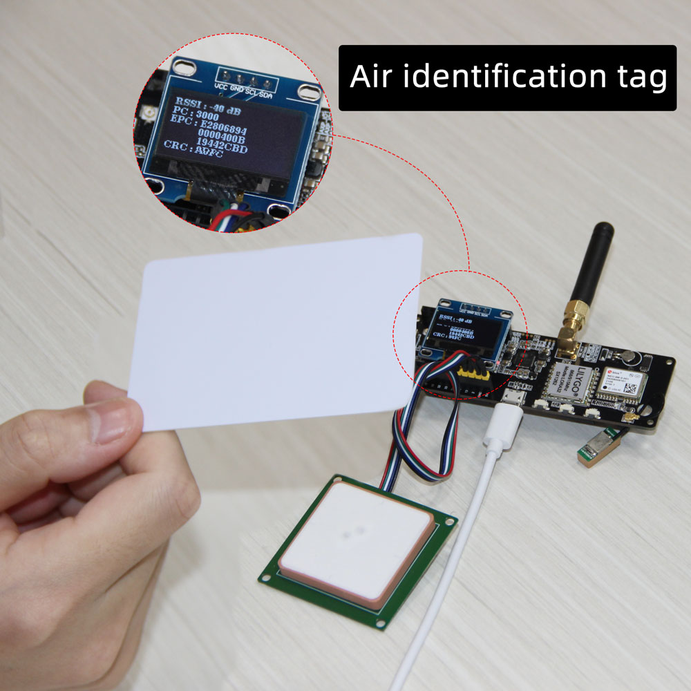

# UHF-reader
MagicRF M100/QM100

## Quick Start
- Find the `\Arduino\libraries\` folder path.
- Use git command to clone all files into libraries.
- Open Arduino, File->Example->UHF-reader->example.

